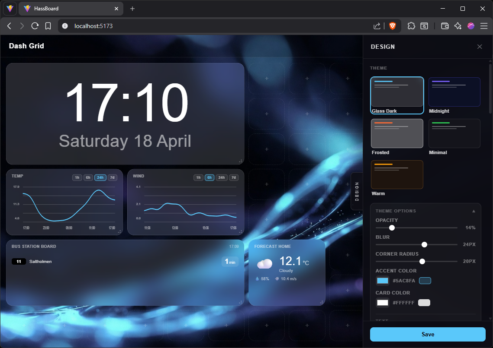
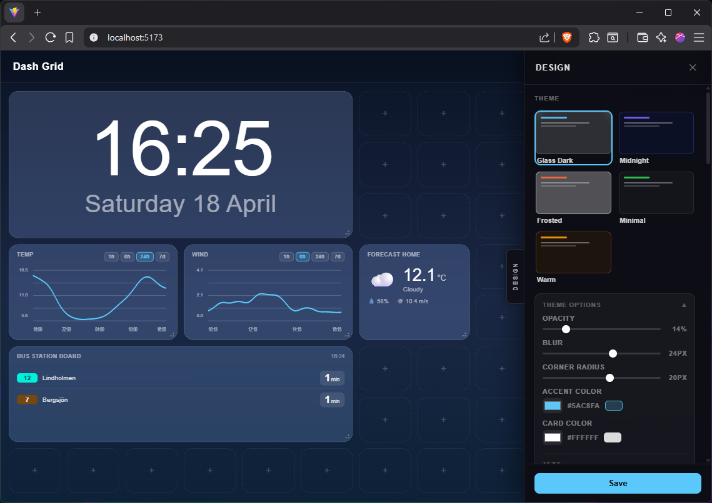
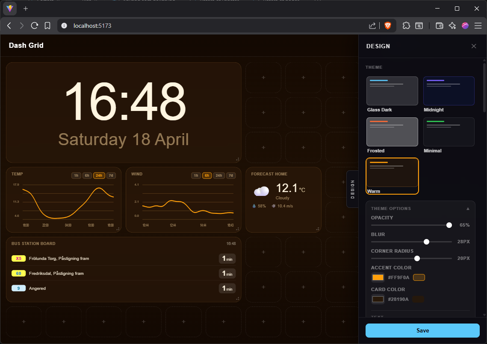
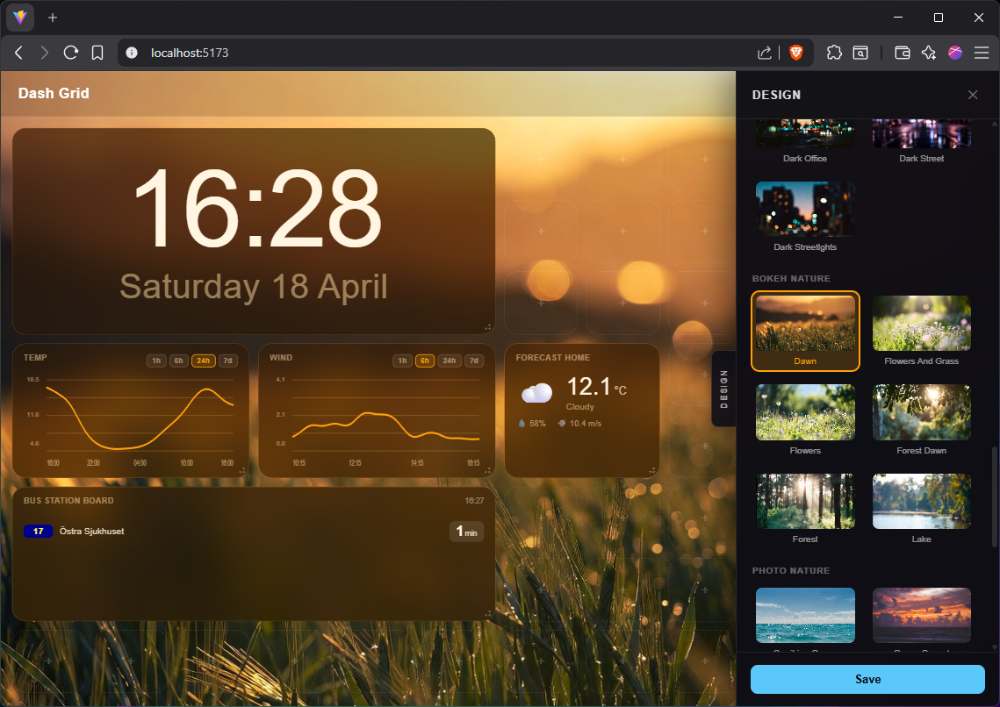
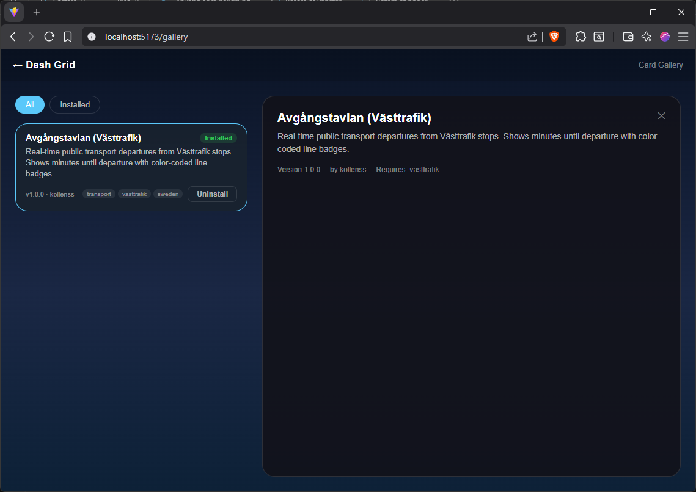
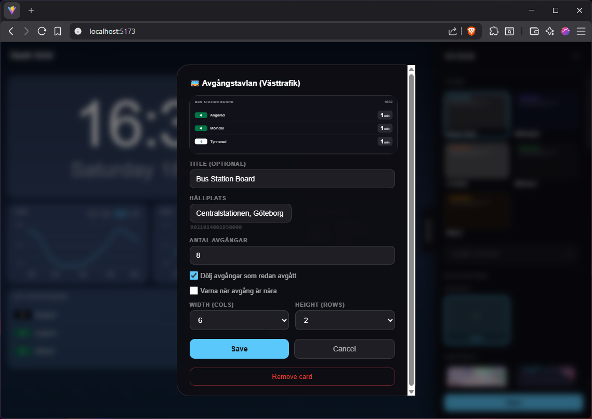
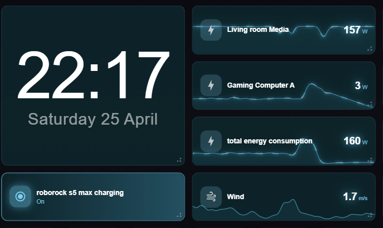
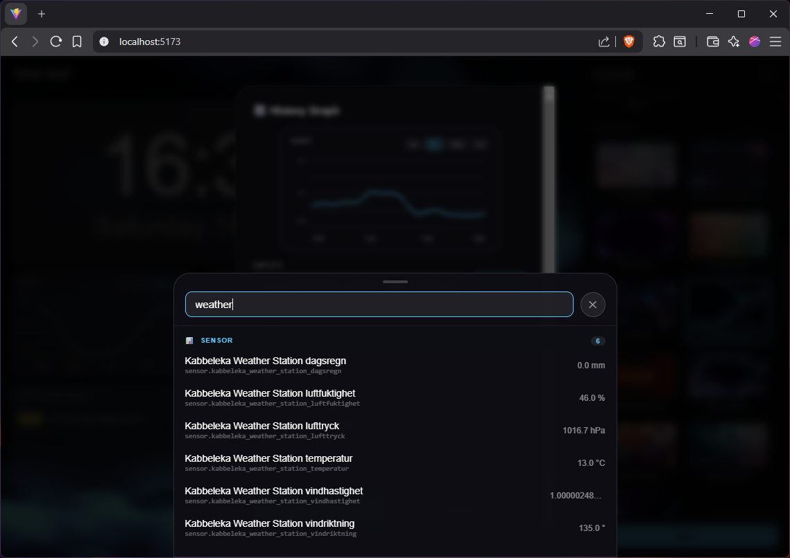
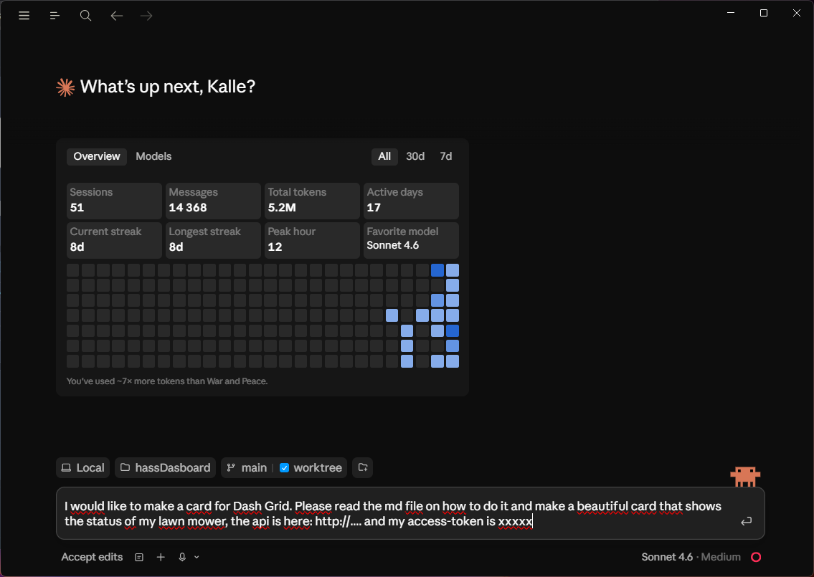

# Dash Grid

A self-hosted, Apple-inspired dashboard for Home Assistant — beautiful out of the box, endlessly customizable without touching a single config file.



---

## Why Dash Grid?

Most dashboards for Home Assistant look fine. Dash Grid looks *good* — and getting there takes seconds, not hours.

- **No YAML.** Everything is configured through a clean UI: drag, drop, click.
- **Built-in themes.** Switch between polished themes with one click, then fine-tune colours, blur, and opacity with sliders.
- **Plugin cards.** Install community-made cards from a gallery — no file editing, no restarts.
- **Flexible layout.** 12-column CSS grid. Make cards any size, stack them, span them.
- **Runs anywhere.** A Raspberry Pi, an old laptop, a NUC — if it runs Node.js it runs Dash Grid.

---

## Screenshots

### Themes & Design

Pick a theme, then make it yours with the design drawer.





### Backgrounds

Swap in a background from the built-in library or use your own image.



### Plugin Cards

Browse and install community cards without leaving the app.





### Button+ Card

The flagship card. Point it at any Home Assistant entity and it figures out the rest — slider for lights and fans, play/pause for media players, live sparkline for sensors. The ambient animation adapts to the entity type: electricity sensors pulse with a flowing blue-white glow, wind sensors trail particle streaks along the wave, battery sensors shift from green to red as they drain. Everything is proportional to the actual value, so a device drawing 300 W glows and flows noticeably faster than one at 50 W — lively enough to feel alive, calm enough to leave on a wall display all day.



Drag across a card to scrub its history. The dot tracks the sparkline and shows the exact value at that moment in time.

### Home Assistant Integration

Search entities, pick a card type, done.



### Build Your Own Cards

Plugin cards are plain TypeScript + React. Use the AI prompt in the gallery to generate a card and share it with the community.



---

## Prerequisites

- **Node.js** v18 or later
- **Home Assistant** with a valid Long-Lived Access Token

---

## Installation

```bash
git clone https://github.com/kollenss/dash-grid.git
cd dash-grid
npm install
```

---

## Configuration

Start the app, then open **Settings** in the interface. Enter your Home Assistant URL and access token — that's it.

| Setting | Description |
|---------|-------------|
| Home Assistant URL | e.g. `http://192.168.1.10:8123` |
| API Token | Long-Lived Access Token from HA → Profile → Security |

Tokens are stored in a local SQLite database and never exposed in plaintext to the client.

<details>
<summary>How to create a HA Long-Lived Access Token</summary>

1. Log in to Home Assistant
2. Click your profile picture (bottom of the sidebar)
3. Scroll down to **Security → Long-Lived Access Tokens**
4. Click **Create token**, give it a name, and copy the value

</details>

---

## Running

**Development**

```bash
npm run dev
```

Opens on [http://localhost:5173](http://localhost:5173)

**Production**

```bash
npx vite build
node dist/server/index.js
```

Opens on [http://localhost:3001](http://localhost:3001) — reachable from other devices on the network.

> Change the port: `PORT=8080 node dist/server/index.js`

---

## Plugin Cards

Cards live in a separate repository: [dash-grid-cards](https://github.com/kollenss/dash-grid-cards)

Browse and install them from the **Cards** menu inside the app.

Want to build your own? See [CARD_DEVELOPMENT.md](docs/CARD_DEVELOPMENT.md) for the plugin API.

---

## Project Structure

```
dash-grid/
├── server/
│   ├── index.ts              ← Fastify server (port 3001)
│   ├── db.ts                 ← SQLite (settings, dashboards, cards, plugins)
│   └── routes/
│       ├── config.ts         ← CRUD: cards, settings, dashboards
│       ├── ha-proxy.ts       ← Proxies Home Assistant REST API
│       ├── ha-ws.ts          ← WebSocket bridge to HA
│       └── plugins.ts        ← Plugin install/uninstall/serve
├── client/src/
│   ├── core/
│   │   ├── CardRegistry.ts   ← Plugin registry (singleton)
│   │   └── types.ts          ← CardDefinition, CardProps, IntegrationDef
│   ├── components/
│   │   ├── cards/            ← Built-in card types
│   │   ├── Grid/             ← 12-column CSS Grid
│   │   ├── PluginGallery/    ← Browse and install plugin cards
│   │   └── settings/
│   └── styles/
├── data/                     ← SQLite database (auto-created, gitignored)
└── plugins/                  ← Installed plugin bundles (gitignored)
```

---

## License

MIT — see [LICENSE](LICENSE)
